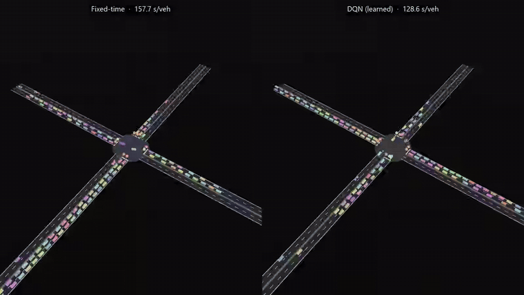
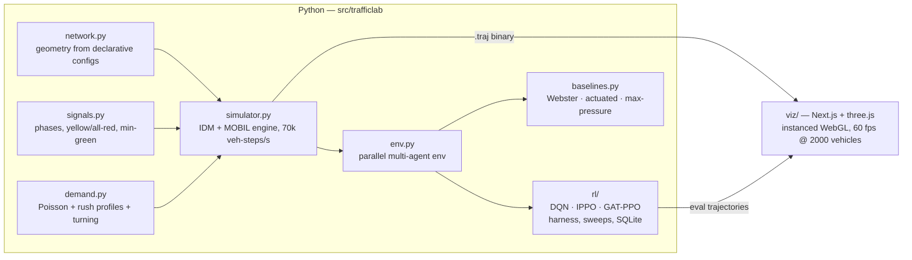

# trafficlab

A multi-agent traffic signal control research platform: a deterministic
IDM+MOBIL microsimulator, a PettingZoo-style multi-agent RL environment with
hand-written DQN / IPPO / GAT-PPO trainers, classical baselines, and a
high-fidelity WebGL trajectory visualizer with synchronized split-screen
policy comparison.



*The same simulated rush hour twice: a fixed 20-second timer (left) vs the
trained DQN policy (right) — 18% less delay per driver on this seed.*

## Architecture



The simulator and visualizer never import each other: everything flows through
the `.traj` binary trajectory format (`docs/TRAJECTORY_FORMAT.md`) — a seekable,
self-contained replay with network geometry, per-tick vehicle states, signal
phases, queues, rewards, and metrics.

## Highlights

- **Simulator** (`src/trafficlab/`): continuous-space IDM car-following + MOBIL
  lane changes, protected-left phasing with yellow/all-red clearance and
  min-green, Poisson demand with time-varying rush profiles and turning
  matrices, byte-identical determinism under a seed, ~70k vehicle-steps/s
  single-core (7× the 10k target). Networks from declarative JSON: single,
  2×2 grid, 4×4 grid, 6-intersection arterial — or arbitrary explicit graphs
  (with geometric phase-conflict validation).
- **Environment**: one agent per intersection; queue/density/phase/time
  observations, min-green action masking, four reward variants (pressure,
  queue, wait, throughput).
- **RL** (`src/trafficlab/rl/`): double-DQN, IPPO with parameter sharing, and a
  graph-attention PPO variant that attends over neighboring intersections —
  pure PyTorch, no RL frameworks. Training harness with seeded runs, atomic
  checkpointing, exact-cadence resume, SQLite metrics, and a multiprocess
  sweep runner. The full sweep→analyze→adjust history lives in
  `docs/EXPERIMENT_LOG.md`.
- **Visualizer** (`viz/`): instanced three.js rendering that holds 60 fps with
  2000 vehicles; scrubbable timeline with per-intersection signal phase strip;
  orbit / top-down / vehicle-follow cameras; toggleable overlays (queue
  heatmaps, phase timers, velocity coloring, trajectory ribbons, pressure
  field); synchronized split-screen policy comparison on a shared clock;
  charts panel (delay, throughput, per-intersection reward) synced to
  playback; in-app video export (webm) and a GIF pipeline.

## Results

Final evaluation: 1-hour episodes, 10 seeds per cell, 95% t-CIs, frozen engine.
Full tables: [`results/TABLES.md`](results/TABLES.md) · plots: `results/plots/` ·
methodology and the full sweep→analyze→adjust history (6 iterations):
[`docs/EXPERIMENT_LOG.md`](docs/EXPERIMENT_LOG.md).

**Single intersection, rush demand** (delay/vehicle, lower is better):

| policy | delay (s/veh) | throughput |
|---|---|---|
| actuated | **111.7 ± 6.8** | 1954 ± 26 |
| **dqn-pressure (s0)** | **112.5 ± 7.2** | 1956 ± 27 |
| dqn-queue (s0) | 126.2 ± 3.0 | 1953 ± 30 |
| webster | 143.5 ± 7.8 | 1953 ± 30 |
| max-pressure | 145.7 ± 11.3 | 1944 ± 42 |
| fixed | 173.2 ± 12.9 | 1936 ± 30 |

**2×2 grid, rush demand:**

| policy | delay (s/veh) | throughput |
|---|---|---|
| actuated | **189.3 ± 7.2** | 3884 ± 40 |
| **ippo-queue (s0)** | **227.9 ± 9.7** | 3798 ± 31 |
| fixed | 247.4 ± 10.7 | 3827 ± 25 |
| gat-queue (s1) | 257.1 ± 12.6 | 3816 ± 26 |
| dqn-queue (s0) | 266.6 ± 11.2 | 3613 ± 44 |


### Findings

1. **Learned control matches the strongest classical controller at an isolated
   intersection** — DQN statistically ties fully-actuated control (112.5 vs
   111.7 s/veh, overlapping CIs) and beats fixed-time by 35%, Webster by 22%,
   and max-pressure by 23%. It also transfers: trained on rush, the dqn-queue
   policy handles light demand at baseline level (33.2 vs fixed 32.4 s/veh).
2. **On the grid, learned coordination beats fixed-time but not actuated** —
   IPPO's shared policy wins the RL bracket (−8% vs fixed) while actuated
   keeps a clear lead. Notably the algorithm ranking *flips* between eval
   horizons: DQN dominated 20-minute training evals but degraded on 1-hour
   episodes (266.6 vs fixed 247.4), while on-policy IPPO generalized —
   train/eval horizon mismatch measurably punishes the off-policy method.
   GAT-PPO learns (−12% vs its no-op floor) but was still improving at budget
   exhaustion; it needs a longer run to be judged fairly.
3. **Naive max-pressure can gridlock a real geometry.** With single-lane
   approaches, one lead left-turner head-of-line-blocks the whole lane; queue
   pressure stays pinned, the argmax never leaves the phase, and the arterial
   collapsed to ~2600 s/veh at 3% throughput. Split phasing for
   single-lane-with-left approaches (now automatic in the network builder)
   fixed every controller's arterial numbers, max-pressure most of all
   (2617 → 266 s/veh).
4. **What it took to make traffic RL learn at all** (iterations 1–5 of the
   log): rewards scaled to O(1) so the value loss cannot bulldoze a shared
   actor-critic trunk; γ = 0.9 rather than 0.97 so credit lands within ~10
   decisions; ~50× more PPO updates than the textbook rollout size gives;
   10 s decision intervals so min-green masking never forces actions. Before
   those fixes, every configuration collapsed to "hold one phase forever."

## Quick start

```bash
# Python: numpy + torch (CPU is fine)
python -m pytest tests/ -q                      # 160+ tests

# simulate a baseline and record a replay
python scripts/simulate.py --network grid2x2 --demand rush \
    --controller max_pressure --duration 900 --out results/trajectories/demo.traj

# train
python scripts/train.py --algo dqn --network single --demand rush --reward queue

# sweep
python scripts/sweep.py --spec configs/sweeps/iter5_factorial.json --processes 6

# evaluate everything (10 seeds, 95% CIs)
python scripts/evaluate.py --seeds 10 --runs runs/<run_name>

# visualize
cd viz && npm install && npm run dev            # drop any .traj on the page
```

## Repository map

| path | contents |
|---|---|
| `docs/TRAJECTORY_FORMAT.md` | the binary contract between sim and viz |
| `docs/SIM_DESIGN.md`, `docs/RL_DESIGN.md` | binding interface contracts the modules were built against |
| `docs/EXPERIMENT_LOG.md` | the sweep→analyze→adjust research log (5 iterations) |
| `configs/` | network, demand, and sweep specs |
| `results/` | eval CSVs, plots, GIFs |
| `viz/scripts/` | headless visual verification + GIF export (Playwright) |
