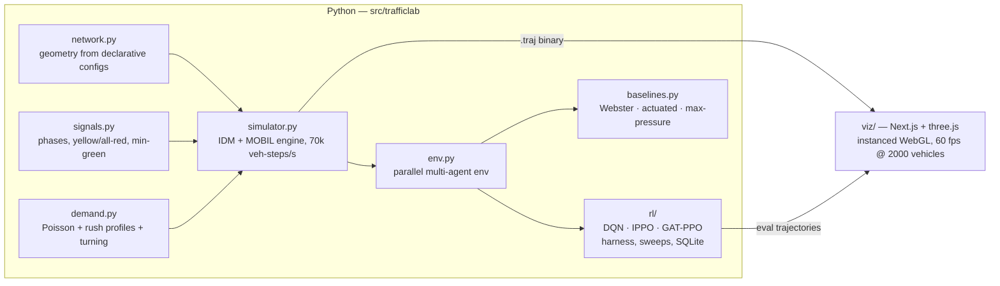

# trafficlab

A multi-agent traffic signal control research platform: a deterministic
IDM+MOBIL microsimulator, a PettingZoo-style multi-agent RL environment with
hand-written DQN / IPPO / GAT-PPO trainers, classical baselines, and a
high-fidelity WebGL trajectory visualizer with synchronized split-screen
policy comparison.


*The same simulated rush hour twice: a fixed 20-second timer (left) vs the
trained DQN policy (right) — 18% less delay per driver on this seed.*

## Architecture



The simulator and visualizer never import each other: everything flows through
the `.traj` binary trajectory format (`docs/TRAJECTORY_FORMAT.md`) — a seekable,
self-contained replay with network geometry, per-tick vehicle states, signal
phases, queues, rewards, and metrics.

## Highlights

- **Simulator** (`src/trafficlab/`): continuous-space IDM car-following + MOBIL
  lane changes, protected-left phasing with yellow/all-red clearance and
  min-green, Poisson demand with time-varying rush profiles and turning
  matrices, byte-identical determinism under a seed, ~70k vehicle-steps/s
  single-core (7× the 10k target). Networks from declarative JSON: single,
  2×2 grid, 4×4 grid, 6-intersection arterial — or arbitrary explicit graphs
  (with geometric phase-conflict validation).
- **Environment**: one agent per intersection; queue/density/phase/time
  observations, min-green action masking, four reward variants (pressure,
  queue, wait, throughput).
- **RL** (`src/trafficlab/rl/`): double-DQN, IPPO with parameter sharing, and a
  graph-attention PPO variant that attends over neighboring intersections —
  pure PyTorch, no RL frameworks. Training harness with seeded runs, atomic
  checkpointing, exact-cadence resume, SQLite metrics, and a multiprocess
  sweep runner. The full sweep→analyze→adjust history lives in
  `docs/EXPERIMENT_LOG.md`.
- **Visualizer** (`viz/`): instanced three.js rendering that holds 60 fps with
  2000 vehicles; scrubbable timeline with per-intersection signal phase strip;
  orbit / top-down / vehicle-follow cameras; toggleable overlays (queue
  heatmaps, phase timers, velocity coloring, trajectory ribbons, pressure
  field); synchronized split-screen policy comparison on a shared clock;
  charts panel (delay, throughput, per-intersection reward) synced to
  playback; in-app video export (webm) and a GIF pipeline.

## Results

Final evaluation: 1-hour episodes, 10 seeds per cell, 95% t-CIs, measured on the
engine as shipped (every number below was regenerated after the lane-change
overlap fix described in finding 5, which moves results by 1–2%).
Full tables: [`results/TABLES.md`](results/TABLES.md) · plots: `results/plots/` ·
methodology and the full sweep→analyze→adjust history (6 iterations):
[`docs/EXPERIMENT_LOG.md`](docs/EXPERIMENT_LOG.md).

**Single intersection, rush demand** (delay/vehicle, lower is better):

| policy | delay (s/veh) | throughput |
|---|---|---|
| **actuated** | **111.1 ± 7.6** | 1941 ± 32 |
| dqn-pressure (s0) | 118.5 ± 4.3 | 1922 ± 46 |
| dqn-queue (s0) | 126.2 ± 6.1 | 1927 ± 28 |
| webster | 143.0 ± 6.5 | 1934 ± 28 |
| max-pressure | 147.9 ± 8.3 | 1974 ± 27 |
| fixed | 171.2 ± 10.8 | 1928 ± 26 |

**2×2 grid, rush demand:**

| policy | delay (s/veh) | throughput |
|---|---|---|
| **actuated** | **191.4 ± 8.3** | 3900 ± 49 |
| webster | 207.9 ± 6.4 | 3855 ± 35 |
| ippo-queue (s0) | 244.1 ± 9.8 | 3771 ± 27 |
| max-pressure | 244.4 ± 6.9 | 3846 ± 37 |
| fixed | 247.4 ± 9.4 | 3821 ± 28 |
| gat-queue (s1) | 269.0 ± 6.8 | 3821 ± 27 |
| dqn-queue (s0) | 274.9 ± 11.9 | 3577 ± 88 |


### Findings

1. **At an isolated intersection, learned control gets close to the strongest
   classical controller but does not beat it.** DQN reaches 118.5 s/veh
   against fully-actuated's 111.1 — the 95% intervals barely overlap, so this
   is at best a tie and more honestly a small loss. It is a decisive win over
   every *fixed* schedule: 31% better than fixed-time, 17% better than Webster,
   20% better than max-pressure. The pattern is consistent across three
   independent training campaigns (see `docs/EXPERIMENT_LOG.md`): actuated
   control is a genuinely strong baseline at a single junction, because
   responding to a presence detector is most of what there is to do.
2. **On the 2×2 grid, none of the learned policies beat the classical
   controllers.** IPPO is the best of them at 244.1 s/veh, which ties
   fixed-time (247.4) and max-pressure (244.4) and loses clearly to Webster
   (207.9) and actuated (191.4). DQN and GAT-PPO are worse than fixed. So the
   multi-agent coordination result is negative at this budget — the honest
   reading is that 60–150k steps on a 4-agent network is not enough, not that
   the architectures fail. Note also that DQN dominated the short training
   evals and then degraded on 1-hour episodes, so train/eval horizon mismatch
   flatters off-policy methods during development.
3. **Naive max-pressure can gridlock a real geometry.** With single-lane
   approaches, one lead left-turner head-of-line-blocks the whole lane; queue
   pressure stays pinned, the argmax never leaves the phase, and the arterial
   collapsed to ~2600 s/veh at 3% throughput. Split phasing for
   single-lane-with-left approaches (now automatic in the network builder)
   fixed every controller's arterial numbers, max-pressure most of all
   (2617 → 266 s/veh).
4. **What it took to make traffic RL learn at all** (iterations 1–5 of the
   log): rewards scaled to O(1) so the value loss cannot bulldoze a shared
   actor-critic trunk; γ = 0.9 rather than 0.97 so credit lands within ~10
   decisions; ~50× more PPO updates than the textbook rollout size gives;
   10 s decision intervals so min-green masking never forces actions. Before
   those fixes, every configuration collapsed to "hold one phase forever."
5. **The test horizon was hiding a real bug.** The MOBIL lane-change gap check
   compared positions but not closing speed, so a car at 12 m/s could accept a
   4.7 m gap ahead of a stopped queue and then physically pass through the car
   in front. The no-overlap property test ran 360 ticks; the bug first fires
   around tick 1193, so it survived every review. It is now fixed and pinned by
   a long-horizon regression test — zero overlaps across 38,400 ticks of the
   four shipped networks. Every number above was regenerated afterwards. The
   general lesson is that an invariant is only tested over the horizon you
   actually simulate, and rare dynamics need long runs, not more assertions.

## Quick start

```bash
# Python: numpy + torch (CPU is fine)
python -m pytest tests/ -q                      # 160+ tests

# simulate a baseline and record a replay
python scripts/simulate.py --network grid2x2 --demand rush \
    --controller max_pressure --duration 900 --out results/trajectories/demo.traj

# train
python scripts/train.py --algo dqn --network single --demand rush --reward queue

# sweep
python scripts/sweep.py --spec configs/sweeps/iter5_factorial.json --processes 6

# evaluate everything (10 seeds, 95% CIs)
python scripts/evaluate.py --seeds 10 --runs runs/<run_name>

# visualize
cd viz && npm install && npm run dev            # drop any .traj on the page
```

## Repository map

| path | contents |
|---|---|
| `docs/TRAJECTORY_FORMAT.md` | the binary contract between sim and viz |
| `docs/SIM_DESIGN.md`, `docs/RL_DESIGN.md` | binding interface contracts the modules were built against |
| `docs/EXPERIMENT_LOG.md` | the sweep→analyze→adjust research log (5 iterations) |
| `configs/` | network, demand, and sweep specs |
| `results/` | eval CSVs, plots, GIFs |
| `viz/scripts/` | headless visual verification + GIF export (Playwright) |
