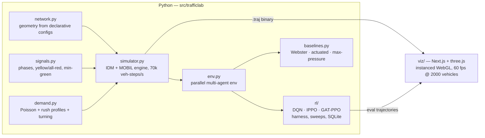

# trafficlab

A multi-agent traffic signal control research platform: a deterministic
IDM+MOBIL microsimulator, a PettingZoo-style multi-agent RL environment with
hand-written DQN / IPPO / GAT-PPO trainers, classical baselines, and a
high-fidelity WebGL trajectory visualizer with synchronized split-screen
policy comparison.

<!-- GIF: results/gifs/compare_single_rush.gif — RL vs fixed-time, same seed -->

## Architecture



The simulator and visualizer never import each other: everything flows through
the `.traj` binary trajectory format (`docs/TRAJECTORY_FORMAT.md`) — a seekable,
self-contained replay with network geometry, per-tick vehicle states, signal
phases, queues, rewards, and metrics.

## Highlights

- **Simulator** (`src/trafficlab/`): continuous-space IDM car-following + MOBIL
  lane changes, protected-left phasing with yellow/all-red clearance and
  min-green, Poisson demand with time-varying rush profiles and turning
  matrices, byte-identical determinism under a seed, ~70k vehicle-steps/s
  single-core (7× the 10k target). Networks from declarative JSON: single,
  2×2 grid, 4×4 grid, 6-intersection arterial — or arbitrary explicit graphs
  (with geometric phase-conflict validation).
- **Environment**: one agent per intersection; queue/density/phase/time
  observations, min-green action masking, four reward variants (pressure,
  queue, wait, throughput).
- **RL** (`src/trafficlab/rl/`): double-DQN, IPPO with parameter sharing, and a
  graph-attention PPO variant that attends over neighboring intersections —
  pure PyTorch, no RL frameworks. Training harness with seeded runs, atomic
  checkpointing, exact-cadence resume, SQLite metrics, and a multiprocess
  sweep runner. The full sweep→analyze→adjust history lives in
  `docs/EXPERIMENT_LOG.md`.
- **Visualizer** (`viz/`): instanced three.js rendering that holds 60 fps with
  2000 vehicles; scrubbable timeline with per-intersection signal phase strip;
  orbit / top-down / vehicle-follow cameras; toggleable overlays (queue
  heatmaps, phase timers, velocity coloring, trajectory ribbons, pressure
  field); synchronized split-screen policy comparison on a shared clock;
  charts panel (delay, throughput, per-intersection reward) synced to
  playback; in-app video export (webm) and a GIF pipeline.

## Results

<!-- RESULTS_TABLE -->

_Full tables with 95% CIs (t-distribution, 10 seeds): `results/`. Plots:
`results/plots/`._

## Quick start

```bash
# Python: numpy + torch (CPU is fine)
python -m pytest tests/ -q                      # 160+ tests

# simulate a baseline and record a replay
python scripts/simulate.py --network grid2x2 --demand rush \
    --controller max_pressure --duration 900 --out results/trajectories/demo.traj

# train
python scripts/train.py --algo dqn --network single --demand rush --reward queue

# sweep
python scripts/sweep.py --spec configs/sweeps/iter5_factorial.json --processes 6

# evaluate everything (10 seeds, 95% CIs)
python scripts/evaluate.py --seeds 10 --runs runs/<run_name>

# visualize
cd viz && npm install && npm run dev            # drop any .traj on the page
```

## Repository map

| path | contents |
|---|---|
| `docs/TRAJECTORY_FORMAT.md` | the binary contract between sim and viz |
| `docs/SIM_DESIGN.md`, `docs/RL_DESIGN.md` | binding interface contracts the modules were built against |
| `docs/EXPERIMENT_LOG.md` | the sweep→analyze→adjust research log (5 iterations) |
| `configs/` | network, demand, and sweep specs |
| `results/` | eval CSVs, plots, GIFs |
| `viz/scripts/` | headless visual verification + GIF export (Playwright) |
